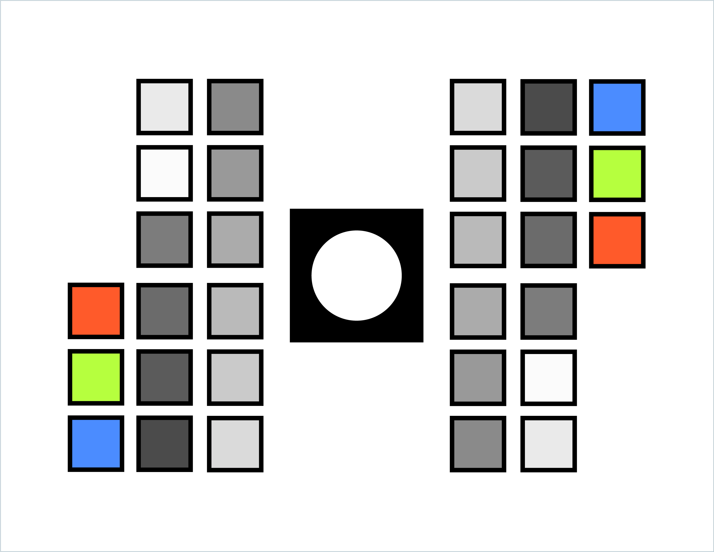

<a href="#link_to_final_report">
<p align="center">


</p></a>
<p align="center">
  <strong>Automate BC Extraction from Filters with Computer Vision</strong>
</p>

# SIS Pipeline

## Project structure (Main project files)
| File Name              |      Description          |
| :-------------------- | :-----------------------: |
| [app/main.py](app/main.py)        | Entry point to application     |
| [app/config.yaml](app/config.yaml)        | App configuration and default parameters     |
| [app/utils.py](app/utils.py)        | Helper functions     |
| [app/calibration.py](app/calibration.py)        | Camera calibration routine     |
| [app/filter_extraction.py](app/filter_extraction.py)        | Filter extraction routine     |

## Setup
### Install Dependencies
```
pip install -r requirements.txt
```

### Install Color Science
```
pip install --user colour-science
```

or 

```
conda install -c conda-forge colour-science
```

## Running Experiments
First, you need to be in the app directory
```
cd app
```

### Filter Extraction

The defaults can be changed in the config.yaml file and the simple command below can be run
```
python main.py extract
```

if any arguments need to be overridden, the cli supports that as well

```
python main.py extract --reference data/RC_RGB_v1.2.4.jpg --inputs data/input_images/v3 --camera oneplus --use_ui_for_calibration False --use_sift True --show_sift_plot False --show_color_correction_plot True
```


**Results**

RGB values of extracted filter are stored in [results.csv](app/output/results.csv)

RGB values of extracted boxes 0 - 29 are stored in [boxes.csv](app/output/boxes.csv)

### Camera Calibration
```
python main.py calibrate

```
overriding defaults
```
python main.py calibrate --camera_id oneplus --path data/input_images/v1 --reference data/RC_RGB_v1.2.4.jpg --use_ui_for_calibration True
```

**Results**

Stored in [camera_parameters_{camera_id}.yaml](app/data/camera_parameters_default.yaml)


## Dependencies
- pandas
- numpy
- colour
- matplotlib
- opencv_python
- PyYAML
- scikit_learn
- colour-science
